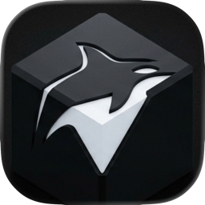
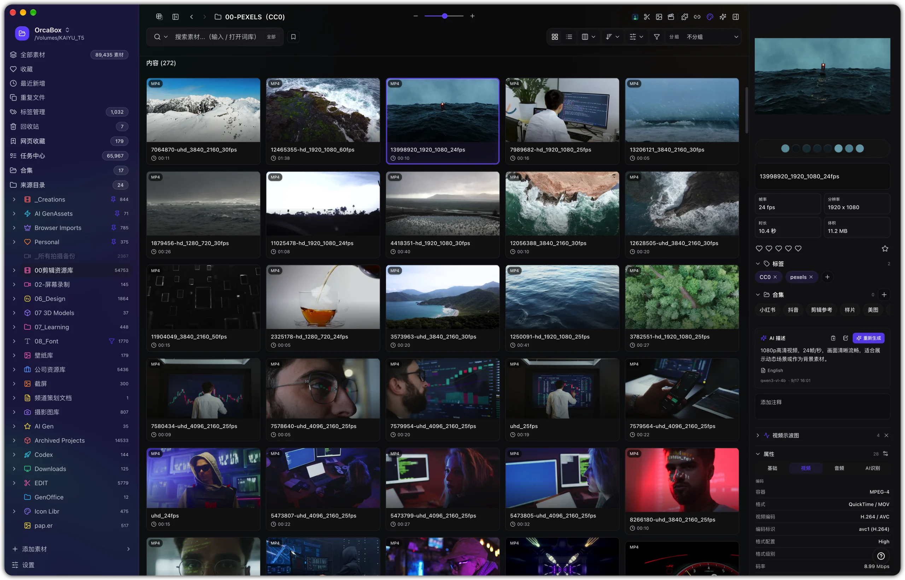
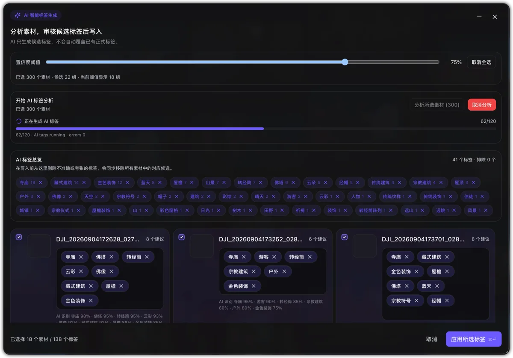
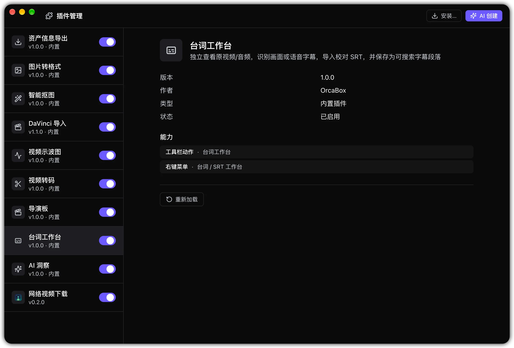
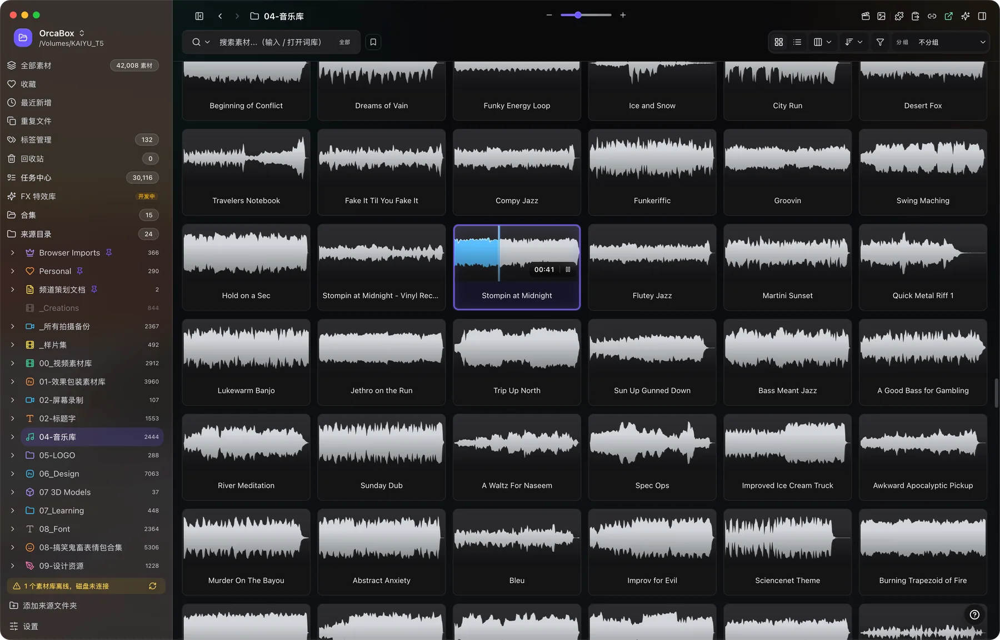
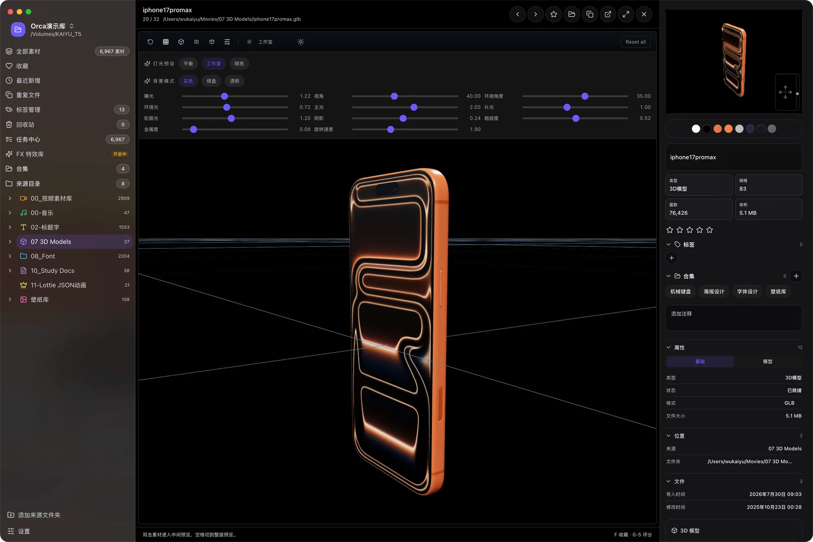
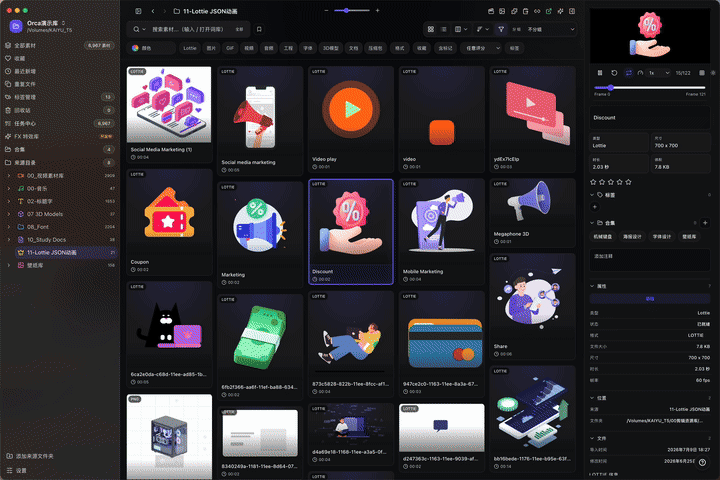

<h1 align="center">OrcaBox</h1>

<strong>A local-first, multi-format asset manager for creators</strong>

Turn files scattered across disks, external drives, and project folders into a searchable, previewable, reusable creative library without moving the originals.

  
  
  
  

   

<a href="https://garrygit888.github.io/OrcaBox-Release/">Website</a> · <a href="https://cnb.cool/garrykai/orcabox-release/-/releases/tag/v1.2.6">CNB Download</a> · <a href="https://github.com/GarryGit888/OrcaBox-Release/releases/tag/v1.2.6">GitHub Download</a> · <a href="./OrcaBox-1.2.6-Release-Notes.md">Release Notes</a> · <a href="https://github.com/GarryGit888/OrcaBox-Release/issues">Feedback</a>

## What is OrcaBox?

OrcaBox is built for editors, designers, motion artists, photographers, and creative teams. Add your existing folders and OrcaBox creates a local index while preserving the original structure. Preview, search, tag, rate, group, filter by color, and use AI-assisted organization from one desktop workspace.

| Principle | What it means |
| --- | --- |
| Local-first | Indexes, databases, and primary analysis stay on your device. |
| Zero-copy organization | Original files remain where they are, with no duplicate library storage. |
| Unified preview | Browse images, video, audio, Lottie, 3D, fonts, documents, and project files together. |
| Creative workflow focus | Move from web capture and search to organization and editor handoff with fewer tool switches. |

## Highlights

- Local indexing across internal disks, external drives, mapped storage, and multiple project roots.
- 40+ preview formats for images, media, motion, 3D, fonts, documents, and creative projects.
- Search and filters for keywords, file type, rating, tags, color, dates, and folders.
- Collections, smart folders, favorites, ratings, notes, tags, and batch tools.
- On-device AI for visual analysis, smart tags, and color-assisted discovery, with optional user-configured remote APIs.
- Stable live Lottie previews, audio waveforms, and synchronized playback surfaces.
- Plugin management, browser capture, conversion tools, and DaVinci Resolve handoff.
- Desktop builds for Apple Silicon, Intel Mac, and Windows x64.

## Product Tour

<table>
  <tr><td width="50%"> <strong>AI Smart Tags</strong> Analyze, review, and apply tags in batches.</td><td width="50%"> <strong>Plugin Center</strong> Enable and manage tools around your workflow.</td></tr>
  <tr><td width="50%"> <strong>Audio Library</strong> Waveforms, playback, search, and batch organization.</td><td width="50%"> <strong>Interactive 3D Preview</strong> Inspect models, materials, and essential metadata.</td></tr>
</table>

 Lottie and JSON motion assets remain live inside the asset grid.

## Supported Asset Families

| Category | Examples |
| --- | --- |
| Images and design | PNG, JPG, WEBP, GIF, SVG, PSD, PSB, AI, EPS, TIFF, HEIC, ICO, ICNS |
| Video | MP4, MOV, MKV, WebM, AVI, M4V, and common professional containers |
| Audio | MP3, WAV, FLAC, AAC, M4A, OGG |
| Motion and 3D | Lottie JSON, `.lottie`, Live Photo, GLB, GLTF, OBJ, FBX, USDZ |
| Fonts and documents | TTF, OTF, PDF, Markdown, text, and common Office documents |
| Creative projects | Premiere Pro, After Effects, DaVinci Resolve, Final Cut Pro, Sketch, and related archives |

Capabilities vary by format, operating system, and local media runtime. Video preview uses original media with safe browser-direct or native/system playback; OrcaBox does not generate proxy video files for preview.

## Quick Start

1. Download the build that matches your operating system and processor.
2. Add one or more source folders. Original files are not copied or moved.
3. Let the local index complete, then organize with search, filters, tags, and collections.
4. Enable AI, browser capture, conversion, or editor integrations when needed.

## Download OrcaBox 1.2.6

| Platform | Primary download | Mirror |
| --- | --- | --- |
| macOS Apple Silicon | [DMG](https://cnb.cool/garrykai/orcabox-release/-/releases/download/v1.2.6/OrcaBox-1.2.6-arm64.dmg) / [ZIP](https://cnb.cool/garrykai/orcabox-release/-/releases/download/v1.2.6/OrcaBox-1.2.6-arm64-mac.zip) | [GitHub Release](https://github.com/GarryGit888/OrcaBox-Release/releases/tag/v1.2.6) |
| macOS Intel | [DMG](https://cnb.cool/garrykai/orcabox-release/-/releases/download/v1.2.6/OrcaBox-1.2.6-x64.dmg) / [ZIP](https://cnb.cool/garrykai/orcabox-release/-/releases/download/v1.2.6/OrcaBox-1.2.6-x64-mac.zip) | [GitHub Release](https://github.com/GarryGit888/OrcaBox-Release/releases/tag/v1.2.6) |
| Windows x64 | [Installer](https://cnb.cool/garrykai/orcabox-release/-/releases/download/v1.2.6/OrcaBox-1.2.6-win-x64-Setup.exe) / [Portable](https://cnb.cool/garrykai/orcabox-release/-/releases/download/v1.2.6/OrcaBox-1.2.6-win-x64-Portable.exe) | [GitHub Release](https://github.com/GarryGit888/OrcaBox-Release/releases/tag/v1.2.6) |
| Chrome extension | [ZIP](https://github.com/GarryGit888/OrcaBox-Release/releases/download/v1.2.6/OrcaBox-Chrome-Extension-1.2.6.zip) | [Release page](https://github.com/GarryGit888/OrcaBox-Release/releases/tag/v1.2.6) |

> Current macOS packages are unsigned test builds. On first launch, macOS may require approval in System Settings > Privacy & Security. Download only from the official release pages above and verify checksums when available.

## Languages and Desktop Stack

      

   

These badges describe the main languages and technologies used to build OrcaBox. **This public binary release repository does not contain OrcaBox's private source code.** It contains release information, public documentation, website files, and product media only.

## Privacy and Support

- OrcaBox centers on a local index and local database; your full asset library does not need to be uploaded.
- On-device AI runs locally. Data reaches a remote service only when you explicitly configure and use its API.
- Review the privacy policy and license of any third-party plugin, model, or API before enabling it.

Report issues with the OrcaBox version, operating system and processor, reproduction steps, and relevant screenshots or log excerpts: [GitHub Issues](https://github.com/GarryGit888/OrcaBox-Release/issues) · [Release history](https://github.com/GarryGit888/OrcaBox-Release/releases) · [CNB releases](https://cnb.cool/garrykai/orcabox-release/-/releases)

---

Copyright 2024-2026 OrcaBox. All rights reserved.

